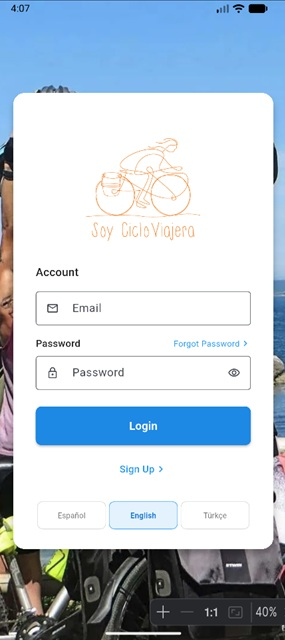

# Soy Cicloviajera — Mobile App

Cross-platform Flutter client for [**Soy Cicloviajera**](https://soycicloviajera.com/), a community of women who travel by bicycle. The app connects members to the platform backend for authentication, profile management, and location-based discovery on an interactive map.

<p align="center">
  
</p>

## About

[Soy Cicloviajera](https://soycicloviajera.com/) is a Spanish cycling-travel community founded in 2017. It helps women discover bike touring through shared stories, events, and training experiences. This repository is the companion mobile application for that platform.

## Features

- **Authentication** — Sign in, registration, forgot-password flow, and token-based passcode reset
- **Multilingual UI** — English, Spanish, and Turkish with in-app language switching
- **Interactive map** — OpenStreetMap-powered view of traveler locations
- **Profile management** — Update name, bio, contact preferences, and contact details
- **Location updates** — Edit location descriptions from the map
- **Session persistence** — Access token stored locally for returning users

## Tech Stack

| Layer | Technology |
| --- | --- |
| Framework | Flutter 3.x |
| Language | Dart |
| Maps | `flutter_map` + OpenStreetMap tiles |
| HTTP | `http`, `dio` |
| Localization | `flutter_localizations`, `intl` |
| Local storage | `shared_preferences` |

## Project Structure

```
lib/
├── config/              # API and environment settings
├── components/          # Shared UI (language switcher)
├── l10n/                # Generated localization files
├── services/            # API clients (auth, map, profile)
├── views/               # Screens (login, register, map, errors)
└── main.dart            # App entry point and routing
```

## Getting Started

### Prerequisites

- Flutter SDK 3.x (stable)
- Dart SDK 3.x
- Android Studio or VS Code with Flutter/Dart plugins
- Android emulator or physical device (iOS on macOS)

### Installation

```bash
git clone https://github.com/Erwinya/soycicloviajera-app.git
cd soycicloviajera-app
flutter pub get
flutter run
```

### Backend configuration

API settings live in `lib/config/api_config.dart`. Override at run time:

```bash
flutter run \
  --dart-define=API_HOST=api.soycicloviajera.com \
  --dart-define=API_USE_HTTPS=true
```

Defaults target local development (`localhost:8080`, HTTP).

On an Android emulator, `localhost` refers to the emulator itself. Use
`10.0.2.2` to reach a backend running on the host machine:

```bash
flutter run --dart-define=API_HOST=10.0.2.2:8080
```

For Android builds on Windows, ensure Flutter uses JDK 21:

```bash
flutter config --jdk-dir="C:\Program Files\Microsoft\jdk-21.0.11.10-hotspot"
```

## Build

```bash
# Android debug APK
flutter build apk --debug

# Android release
flutter build apk --release

# Android App Bundle (Play Store)
flutter build appbundle --release
```

## API Overview

The app expects a REST backend with endpoints such as:

- `POST /api/traveller/login`
- `POST /api/traveller/register`
- `GET /api/locations`
- `PATCH /api/locations`
- `PUT /api/profile`
- `POST /api/forgot-passcode`
- `GET /api/validate-reset-token`
- `POST /api/reset-passcode/{token}`

Authenticated requests use an `X-Token` header with the access token returned at login.

## Related Links

- Community website: [soycicloviajera.com](https://soycicloviajera.com/)
- Author: [Haluk Kılınçer](https://github.com/Erwinya)

## License

MIT — see [LICENSE](LICENSE).
